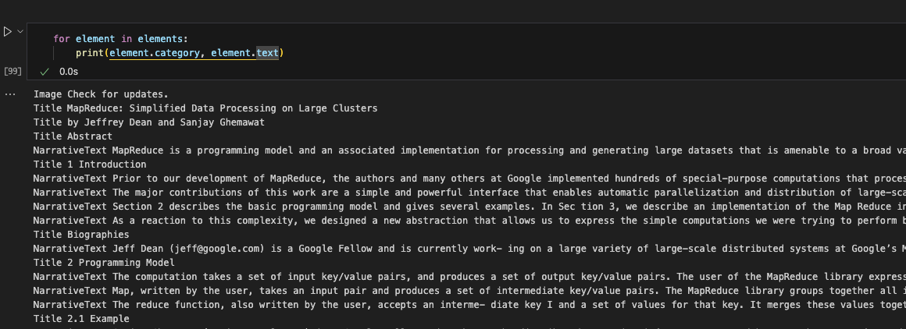
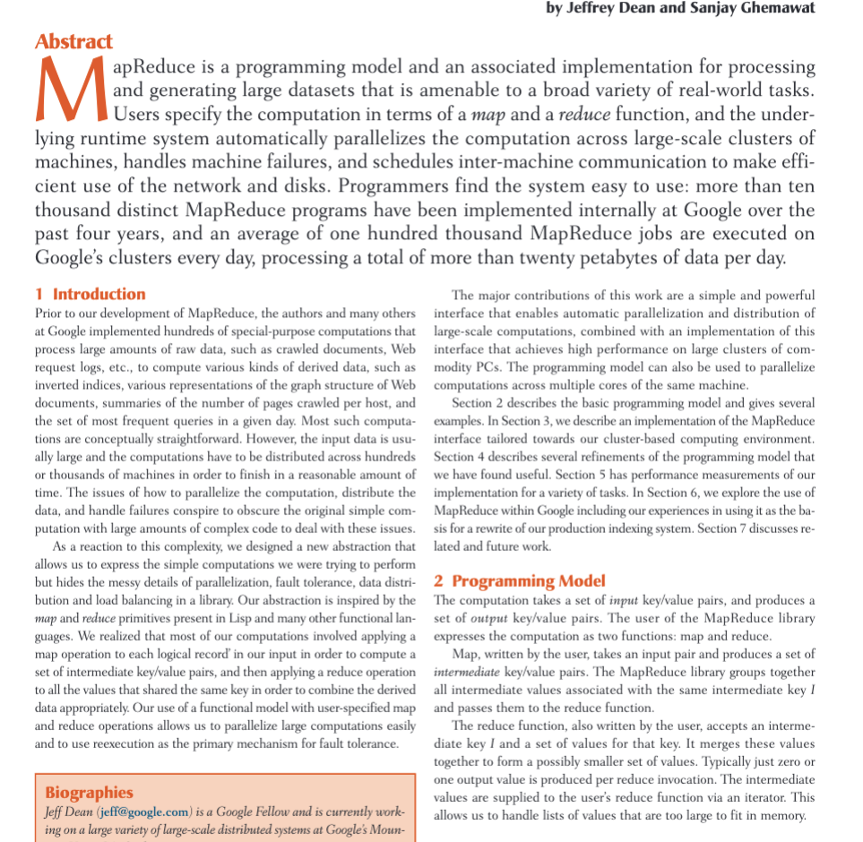
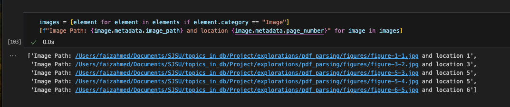
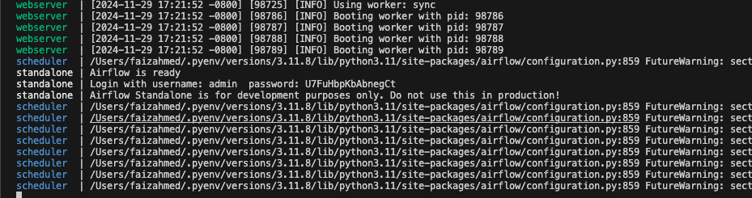

# RAG on research papers

## TODO
- [x] Parse the documents and extract text
- [ ] Investigate different chunking strategies
  - [ ] Come up with way to compare/benchmark
  - [x] Basic chunking + dense retriever
- [ ] Ingesting the data and add all the data into qdrant database
  - [ ] Apache Airflow
  - [ ] RabbitMQ- [ ] Apache Airflow setup using redis
- [ ] Agentic search => Allow it to make searches by itself, also allow it to open, and get parts of pdf.
- [ ] Dense retriever vs sparse retriever
- [ ] Hybrid Search
- [ ] If time permits, add image search
- [ ] If time permits, add a UI or else make it a terminal command
- [ ] Make it recreatable and add documentation


## Parsing the documents
### Extracting the information
After investigating pymupdf, pymupdf4llm and unstructured in `explorations/pdf_parsing`, we found that using unstructured was the way to go because:
- It provides an easy way to parse a PDF along with extracting images.
- It provides a clean API and is widely used.

We notice that the library cleanly separates each `.category` into some of the following:
```python
    {'FigureCaption',
    'Formula',
    'Header',
    'Image',
    'ListItem',
    'NarrativeText',
    'Table',
    'Title'}
```

Therefore, we can extract sections using a title followed by narrative texts until the next title OR end of document.




We can also extract images using



### Cleaning the data


## Data Ingestion
### Setting up Apache Airflow
`pip install apache-airflow`
`pip install "apache-airflow[kubernetes]"`

`./start-airflow.sh`


## Installation
- Install all required deps using `pip install -r requirements.txt`
- We will be using Qdrant for the vector database. We can start it by using `docker compose up`
- Add a `.env` file at the project root with the following variables
  ```
    OPENAI_API_KEY=st...
  ```


## References
[Unstructured for data extraction and cleaning](https://docs.unstructured.io/open-source/introduction/overview)<br/>
[Notebook showing different ways to handle chunking](https://github.com/FullStackRetrieval-com/RetrievalTutorials/blob/main/tutorials/LevelsOfTextSplitting/5_Levels_Of_Text_Splitting.ipynb)
Langchain OpenAI